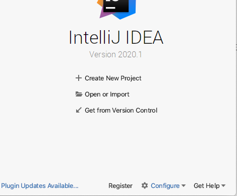
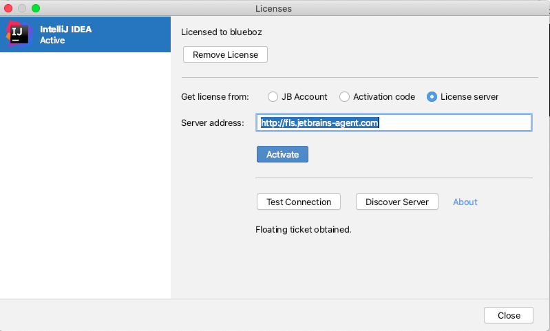

# IDEA 2020 激活方案

1. 首先下载在这里jetbrainsCrack.jar[补丁下载地址](/dist/lib/jetbrainsCrack.jar)

2. 并且存放到指定的一个目录，笔者是存放到/Users/blueboz/jetbrainsCrack.jar目录，记住这个目录，因为待会是要使用的。

3. 启动下载并且安装好的IDEA ，会提示注册，我们先点击试用30天
4. 点击Configure->Edit Custom Vm Options

5. 在文件的结尾追加一行 `-javaagent:/Users/blueboz/jetbrainsCrack.jar` ，记住，这里的路径一定要是修改成为刚那个路径。

6. 重启IDEA，进入主界面之后，点击Register

   

7. 在server address里面输入图中的地址http://fls.jetbrains-agent.com进行激活即可，一般情况是不需要点击的，但是如果你是在离线的情况下，url是不会自动出来的，这时候，请手工填写就行了。

